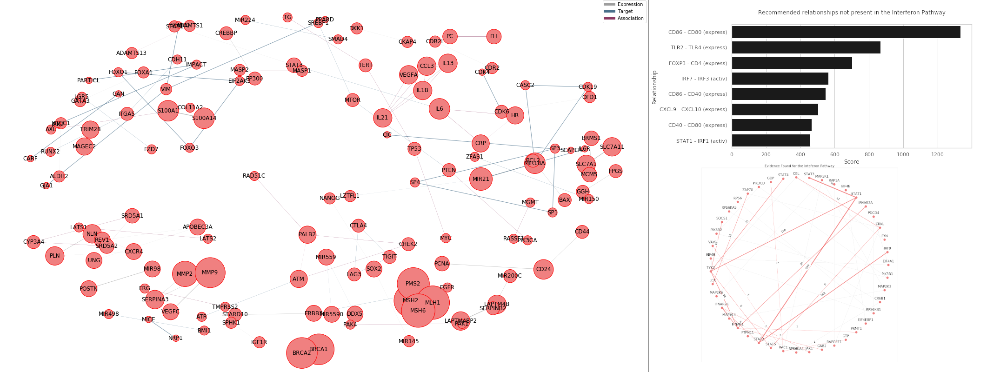

# Postprocessing

Pangaea tool provides a scalable way of fetching NCBI abstracts that match specific keywords, parse the texts, and extract relationships between specific genes. The output of this process is a JSON file that the user can analyze according to their downstream needs. To provide an example of how the JSON file may be processed, we provide a Jupyter notebook file that loads a JSON file and shows several ways to visualise the data.

## Availability

Notebook available in the `notebooks` directory placed in the repository root directory: [notebooks/visualisation.ipynb](https://github.com/ss-lab-cancerunit/pangaea/blob/master/notebooks/visualisation.ipynb).

## Summary

In the notebook, we present how a user may:

### 1. Visualise interactions

The JSON file encodes interactions that can be stored in a graph format and visualised. During visualisation, properties such as number of connections are highlighted through graph properties such as node size, which can further highlight important genes. Similarly, graph visualizing algorithms can make use of clustering to present partitions of genes and interactions that may show a higher degree of connectivity (relationships.)

### 2. Get recommended interactions that do not exist in a pathway

Given known pathway interactions, the data may be used to identify likely interactions that may be relevant to the pathway provided but are not present in the pathway data provided. The recommendations are based on count, but it can be extended to use more complicated scoring systems or adapted to a supervised learning problem with a binary label reflecting whether the pathway data indicates an interaction between any pair of genes.

### 3. Find evidence found for a pathway

Given pathway data, the JSON file can be used to quantify a level of evidence for the pathway interactions provided. This process can be further considered beyond visualization as the evidence is not only quantified but also described by the papers which contribute to the evidence. Thus, more detailed analysis can be pursued by identifying the papers that contribute to evidence for interactions that have low evidence.

