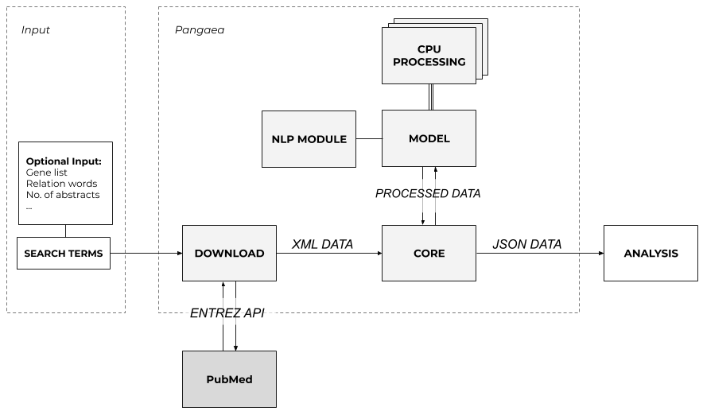
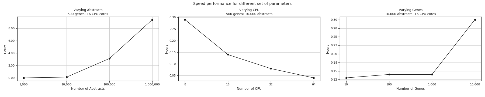

# Overview

The typical workflow for the tool is as follows:

1. Provide search terms for the tool to retrieve relavant articles and store the data in an XML file;
2. The XML file will then be read by chunks to process the information in a structured format;
3. Each article is processed in parallel and the information is stroed in a JSON file on disk.

## Output

Example JSON output with dummy values:

	[
	  {
		"Article Title": "Clinical trial of X",
		"Journal Title": "Cancer",
		"PMID": "999999",
		"Year": "2019",
		"Relations": [
		  {
			"Genes": [
			  "brca2",
			  "tp53"
			],
			"Stems": [
			  "associat"
			],
			"Sentence": "We demonsrate an associatiation between previously published SNPs affecting BRCA2 and TP43"
		  }
		]
	  },
	...
	]

# Usage

The tool expects either an XML file in the format used by Entrez for the PubMed database, or specific terms to search for and download PubMed articles itself. Therefore, to distinguish between the 2 modes, the tool should be called with one of these 2 keywords: `local` or `download`.

## Download new files

Similarly, to download new articles, use the following format:

    $ pangaea download "tp53"

By default, the tool downloads only the first 10 results. To change the limit pass the `--number` argument:

    $ pangaea download "mdm2 or tp53" --number 20000

For advanced search syntax, the tool uses PubMed functionality; more details [here](https://www.ncbi.nlm.nih.gov/pubmed/advanced).

## Existing XML file

The XML file may be generated using [download-entrez](https://github.com/ss-lab-cancerunit/download-entrez). To pass an XML file to the tool, just type in the name of the file after the mode.
    
    $ pangaea local tp53.xml

By default, the tool stores the output in a file named `output.json` in the current directory. Pass the `--output` flag to specify an output file:

    $ pangaea local --output=output_tp53.xml tp53.xml 

## General help

For more information, please use:

    $ pangaea --help
    $ pangaea download --help
    $ pangaea local --help

## Performance

### Workflow

At the moment, the gene extraction uses the following workflow:

- Use a sentence tokenizer to split the text into sentences
    - At the moment, it's using [Punkt Sentence Tokenizer](http://www.nltk.org/api/nltk.tokenize.html#module-nltk.tokenize.punkt) as implemented in NLTK
- Replace "/" with " / " 
    - This is perfomred in order to treat words around the "/" as separate words
- Checks if within the current sentence there's a relation word
    - This is done using the dictionary from the [stems.csv](data/raw/stems.csv) file
- Eliminate all punctuation
    - It is not clear whether it'd be better to keep dashes ("-")
- Convert sentence to lowercase
- Use a word tokenizer to split the sentence into words
    - At the moment, it uses [Treebank tokenizer](http://www.nltk.org/api/nltk.tokenize.html#module-nltk.tokenize.punkt) as implemented in NLTK
- Remove stopwords
    - Remove only stopwords that are not also gene names using this [compiled list](data/processed/stopwords.json).
- Use Part-of-Speech tagger to tag each word with a PoS
    - At the moment, it uses the [Perceptron Tagger](http://www.nltk.org/_modules/nltk/tag/perceptron.html) as implemented by NLTK
- Split the words in a sentence into n-grams
    - At the moment, `N = 4`
- Skip any n-gram in which none of the words are part of the target tags
    - The target tags at the moment are `['NNP', 'NN', 'JJ']`
- Loop through all possible combinations of the words in the current n-gram (a non-null powerset)
- Create a new word from each combination by concatenating the words in the combination
- Loop through all short gene names and detect if they *are identical* to the new word
    - Short gene names at the moment are gene names under 6 characters
- Loop through all long gene names and detect if they are *substrings* of the new word
- If at least one gene name is found, store the details of the article where it has been found (article title, journal title, PMID, year, relations found)
